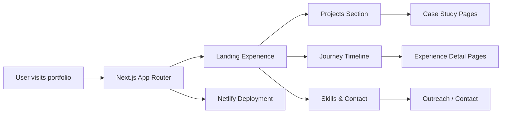

# Zain Amir Portfolio

<div align="center">

  
  
  
  
  

  <h3>Creative developer portfolio with cinematic motion and immersive storytelling.</h3>

</div>

A premium personal portfolio built with Next.js, Tailwind CSS, and motion-driven UI patterns to showcase work, leadership, innovation, and projects in a visually distinctive way.

## ✨ About the Project

This portfolio is more than a resume — it is a digital identity and experience space. It blends design, engineering, and storytelling to present:

- featured projects and product work
- leadership initiatives and community impact
- technical and creative capabilities
- professional journey and experience timeline
- a strong visual identity for personal branding

The design language is dark, futuristic, and high-contrast, with ambient gradients, animated layers, and layered glassmorphism-inspired surfaces.

## 🚀 Highlights

- immersive atmospheric background with dynamic glow and starfield effects
- animated project and journey sections with smooth motion transitions
- clean responsive layout for desktop, tablet, and mobile
- modern app-router architecture using Next.js
- strong focus on storytelling and personal brand presentation
- deployment-ready setup for Netlify

## 🧩 Tech Stack

### Frontend
- Next.js 14
- React 18
- TypeScript
- Tailwind CSS

### Motion & Visuals
- Framer Motion
- GSAP
- Three.js
- React Three Fiber
- Lottie React

### Tooling
- ESLint
- PostCSS
- Netlify

## 🏗️ Architecture Overview



## 📁 Project Structure

```bash
.
├── public/
│   └── ezgif-split/
├── src/
│   ├── app/
│   │   ├── fonts/
│   │   ├── journey/
│   │   ├── projects/
│   │   ├── globals.css
│   │   ├── layout.tsx
│   │   └── page.tsx
│   └── components/
│       ├── AmbientStars.tsx
│       ├── Atmosphere.tsx
│       ├── Contact.tsx
│       ├── ContactTransition.tsx
│       ├── Navbar.tsx
│       ├── Overlay.tsx
│       ├── Projects.tsx
│       ├── ScrollyCanvas.tsx
│       ├── Skills.tsx
│       └── SpotlightCard.tsx
├── netlify.toml
├── next.config.mjs
├── package.json
├── postcss.config.mjs
├── tailwind.config.ts
├── tsconfig.json
├── next-env.d.ts
├── README.md
└── .gitignore
```

## ⚙️ Getting Started

### Prerequisites

- Node.js 18 or newer
- npm or yarn

### Installation

```bash
git clone https://github.com/zain-amirr/Portfolio.git
cd Portfolio
npm install
```

### Run the app locally

```bash
npm run dev
```

Then visit:

```text
http://localhost:3000
```

## 📜 Available Scripts

| Command | Description |
| --- | --- |
| `npm run dev` | Start the development server |
| `npm run build` | Create a production build |
| `npm run start` | Run the production build locally |
| `npm run lint` | Check the project with ESLint |

## 🌐 Deployment

This project is configured for deployment on Netlify.

```toml
[build]
  command = "npm run build"
  publish = ".next"

[[plugins]]
  package = "@netlify/plugin-nextjs"
```

### Deploy steps

1. Push the project to GitHub
2. Connect the repository to Netlify
3. Set the build command to `npm run build`
4. Publish the project from the `.next` output directory

## 💼 Featured Portfolio Areas

- Professional journey and growth
- leadership and organizational experience
- engineering and product-oriented projects
- digital storytelling and visual identity
- creative execution with measurable outcomes

## 🧠 Notes

- The navigation is structured around immersive sections rather than a traditional static portfolio layout.
- The app emphasizes premium motion design and user experience.
- Project and journey pages are organized under the app directory for clean route-based expansion.

## 👤 Creator

Built and designed by Zain Amir.

## 📌 License

This project does not currently include a formal license declaration. If you want to reuse or adapt the code, please contact the author before using it commercially or publicly.

---

<div align="center">
  <strong>Designed for impact. Built for the web.</strong>
</div>
